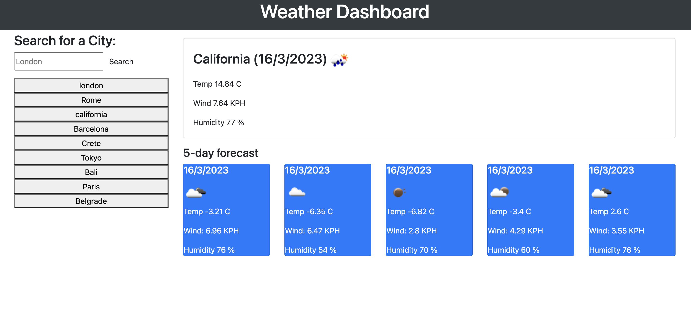

# Weather-Dashboard

An interactive application that displays a 5-day weather forecast of any location.

## Description

The aim of this project was to create a functional application that would display a 5-day forecast which included the temperature, humidity and wind speed of any location entered into the search bar.

## Usage

A weather application was made using JavaScript, JQuery, Bootstrap, an API and HTML. The purpose of this application was to allow users to find a 5-day forecast of various locations of their choosing. The application lists the searched locations in a column that can be reselected in the future.

## License

Weather-Dashboard is licensed under the MIT license.

## Installation

To use the Weather-Dashboard please open the deployed link in your browser. To find a forecast the user must enter a location into the search bar, then click the button to search. After pressing the button a 5-day forecast will appear including the temperature in celcius, the wind speed and humidity. When locations are searched, the location will be saved onto the left side of the page so that the next time the user visits the application they can easily access previously searched locations.

## Deployed webpage link

https://aliceangelica.github.io/Weather-Dashboard/
